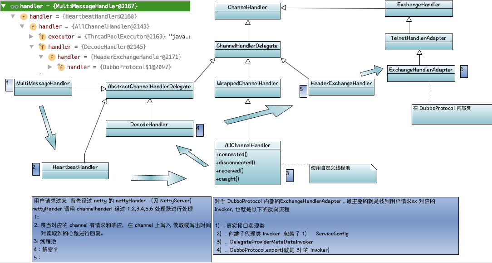

- NettyServer 接收到客户端请求 , 经过 Netty 框架的三个 Pipeline

  - decoder
  - encoder 
  - nettyHandler (重点)： NettyHandler 对于请求委托给 MultiMessageHandler
  
- NettyHandler

  - 方法channelConnected： 将 channel 添加到 Map 里。 `注：心跳要使用`
  - 方法channelDisconnected： 将 channel 移出 Map。

- MultiMessageHandler  > HeartBeatHandler > AllChannelHandler > DecodeHandler > HeadExchangeHandler > ExchangeHandleAdapter

  

  - MultiMessageHandler 
  - HeartBeatHandler 
  - AllChannelHandler   使用线程池处理请求
  -  DecodeHandler 
  - HeadExchangeHandler

  